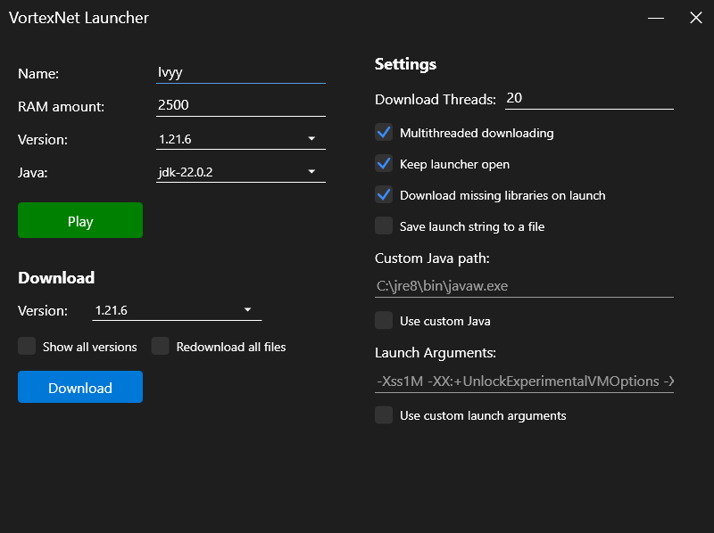

## Vortex Minecraft Launcher (WPF Edition)

.NET port of [Vortex Minecraft launcher](https://github.com/Kron4ek/minecraft-vortex-launcher) by Kron4ek.

Source code was translated by Claude 3.7. 
I haven't tested it thoroughly, so there might be bugs!

I just made a cool UI.

---

## Features

* Lightweight (if you have .NET Runtime installed) and fast
* Open-Source
* ~~Cross-Platform~~ Windows only
* Supports all Minecraft versions
* ~~Supports Forge and other APIs~~
* Downloads all Minecraft versions
* ~~Downloads missing libraries~~
* Doesn't require Minecraft account
* Doesn't require Java to work
* Can work fully offline

---

## Download

Check the [**Releases**](https://github.com/ivymerfe/VortexNet/releases) page

---

## Screenshots

---

## License

[GPLv3](https://github.com/Kron4ek/minecraft-vortex-launcher/blob/master/LICENSE.txt)
