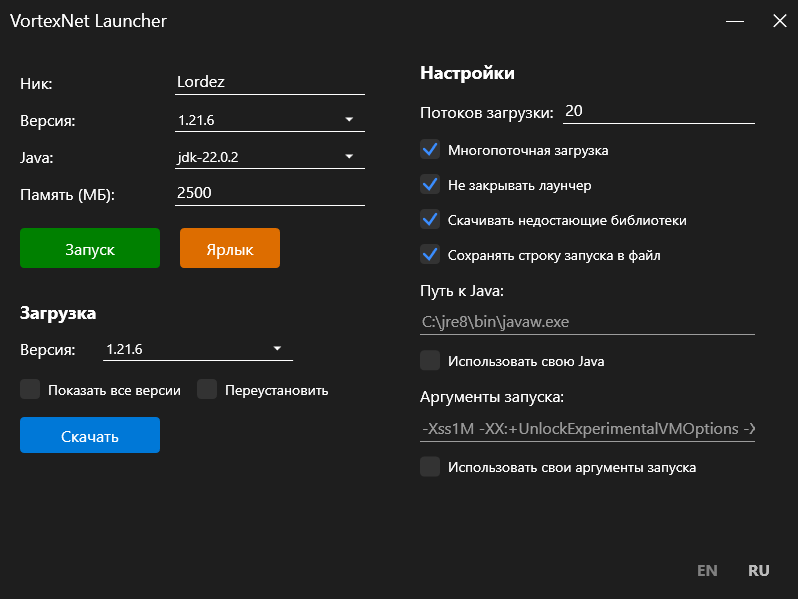

## Vortex Minecraft Launcher (WPF Edition)

.NET порт [Vortex Minecraft launcher](https://github.com/Kron4ek/minecraft-vortex-launcher) от Kron4ek.

Исходный код был переведен с помощью Claude 3.7.
Могут быть ошибки, пишите о них в Issues

Отличается от оригинала улучшенным интерфейсом и отсутствием некоторых функций :).

## Особенности

* Легкий и быстрый
* Открытый исходный код
* ~~Кросс-платформенный~~ Только для Windows
* Поддерживает все версии Minecraft
* ~~Поддерживает Forge и другие API~~
* Загружает все версии Minecraft
* ~~Загружает отсутствующие библиотеки~~
* Не требует учетной записи Minecraft
* Не требует Java для работы
* Может работать офлайн

## Скачать

Смотрите страницу [**Releases**](https://github.com/ivymerfe/VortexNet/releases)

## Скриншоты

## Лицензия

[GPLv3](https://github.com/Kron4ek/minecraft-vortex-launcher/blob/master/LICENSE.txt)
